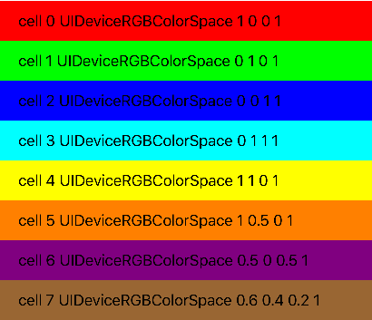

# 1-颜色解决方案

```objc
let colorArray:[UIColor] =
        [
            UIColor.redColor(),
            UIColor.greenColor(),
            UIColor.blueColor(),
            UIColor.cyanColor(),
            UIColor.yellowColor(),
            UIColor.orangeColor(),
            UIColor.purpleColor(),
            UIColor.brownColor(),
        ]
```
