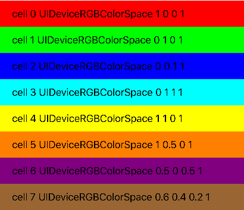

# UIColor 颜色解决方案

###1 选择几个代表性的颜色，用于后期的颜色生成。

```objc
let colorArray:[UIColor] =
        [
            UIColor.redColor(),
            UIColor.greenColor(),
            UIColor.blueColor(),
            UIColor.cyanColor(),
            UIColor.yellowColor(),
            UIColor.orangeColor(),
            UIColor.purpleColor(),
            UIColor.brownColor(),
        ]
```


###2 遍历colorArray 数组，根据alpha值，获取颜色。

```objc
 for(var i=0;i<colorArray.count;i++) {
             let color = colorArray[i]
            for(var j=1;j<11;j++) {
                if j == 1 || j == 3 || j == 6 || j == 9{
                    // 改变透明值，取出1，3，6，9 对应的透明
                    let col = color.colorWithAlphaComponent(CGFloat(j) / 10)
                    colors.append(col)
                }
            }
        }
```

###3 效果图

